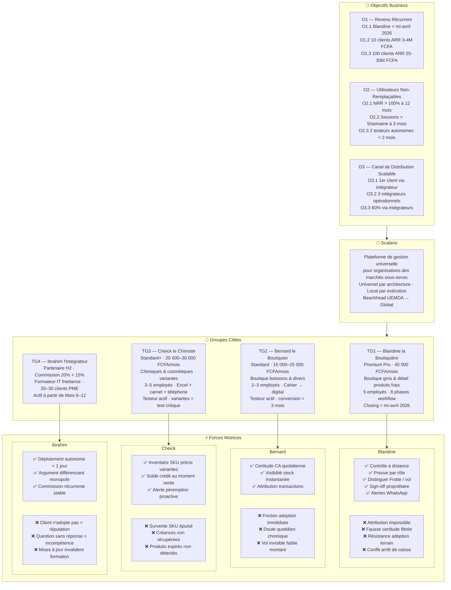

# Trigger Map Scalario — Hub

**Phase 2 : Trigger Mapping | Document Principal**
**Généré :** 2026-03-31 | Mode Dream
**Version :** 1.0

---

## Vue d'ensemble

Le Trigger Map Scalario traduit la vision produit en forces motrices humaines concrètes. Il répond à la question fondamentale : **pourquoi des personnes réelles, dans des situations réelles, changeraient-elles leur comportement à cause de Scalario ?**

Cette carte est le pont entre la stratégie business (objectifs) et les décisions design (ce qu'on construit, dans quel ordre, avec quel message).

---

## Diagramme — Structure Complète

---

## Table de Priorité — Groupes Cibles

| Priorité | Persona | Tier | Horizon | Rôle Stratégique |
|---|---|---|---|---|
| 🥇 P1 | Blandine la Boutiquière | Premium Pro | H1 immédiat | Gate 1 — revenu + référence crédibilité |
| 🥈 P2 | Bernard le Boutiquier | Standard | H1 court | Gate 2 — validation modèle volume + archétype intégrateur |
| 🥉 P3 | Cheick le Chimiste | Standard+ | H1 moyen | Gate 2 — validation marché sophistiqué + NRR anchor |
| 4️⃣ P4 | Ibrahim l'Intégrateur | Partenaire | H2 | Gate 5 — canal distribution autonome |

---

## Focus Stratégique — La Tension Créative Centrale

> **"Scalario est universel par architecture, local par exécution."**

Chaque décision produit se joue entre ces deux pôles :

- **Architecture universelle** — offline-first, payment adapters, i18n, compliance pluggable, variants system, audit trail — tout doit fonctionner pour n'importe quel marché
- **Exécution locale** — Taux de Frotte, vrac→sachet, FCFA, OHADA, mobile money, WhatsApp — chaque feature locale est une instance d'un pattern universel

Le beachhead UEMOA n'est pas un compromis : c'est la preuve par l'extrême. Si Scalario fonctionne ici (offline quotidien, infrastructure variable, mixité technologique, commerce informel), il fonctionne partout.

---

## Documents du Trigger Map

| Document | Contenu |
|---|---|
| [01-Business-Goals.md](01-Business-Goals.md) | Objectifs 3×3 : O1 Revenu · O2 Rétention · O3 Distribution |
| [02-Blandine-Boutiquiere.md](02-Blandine-Boutiquiere.md) | Persona P1 — 5 forces positives + 4 négatives |
| [03-Bernard-Boutiquier.md](03-Bernard-Boutiquier.md) | Persona P2 — 3 forces positives + 3 négatives |
| [04-Cheick-Chimiste.md](04-Cheick-Chimiste.md) | Persona P3 — 3 forces positives + 3 négatives |
| [05-Ibrahim-Integrateur.md](05-Ibrahim-Integrateur.md) | Persona P4 — 3 forces positives + 3 négatives |
| [06-Key-Insights.md](06-Key-Insights.md) | 5 insights stratégiques + table priorités design |

---

## Décisions Produit Issues du Trigger Map

| Priorité | Force motrice | Implication |
|---|---|---|
| 🔴 P1 | Preuve de responsabilité par rôle | Audit trail visible = Core non-négociable |
| 🔴 P2 | Certitude quotidienne sur la caisse | Arrêt de caisse guidé < 5 min = Core non-négociable |
| 🔴 P3 | Friction d'adoption zéro | Onboarding Standard = produit à part entière |
| 🟡 P4 | Contrôle à distance propriétaire | Dashboard mobile + WhatsApp = Premium différenciant |
| 🟡 P5 | Distinguer perte naturelle de vol | Taux de Frotte = Premium opt-in |
| 🟡 P6 | Gestion variantes par SKU | Variantes = Core Standard+ |
| 🟢 P7 | Déploiement autonome intégrateur | AI Config Wizard = H2 prérequis |

---

*Source : Trigger Map Scalario v1 · WDS Phase 2 · 2026-03-31*
*Généré en Dream Mode par Saga — Whiteport Design Studio*
