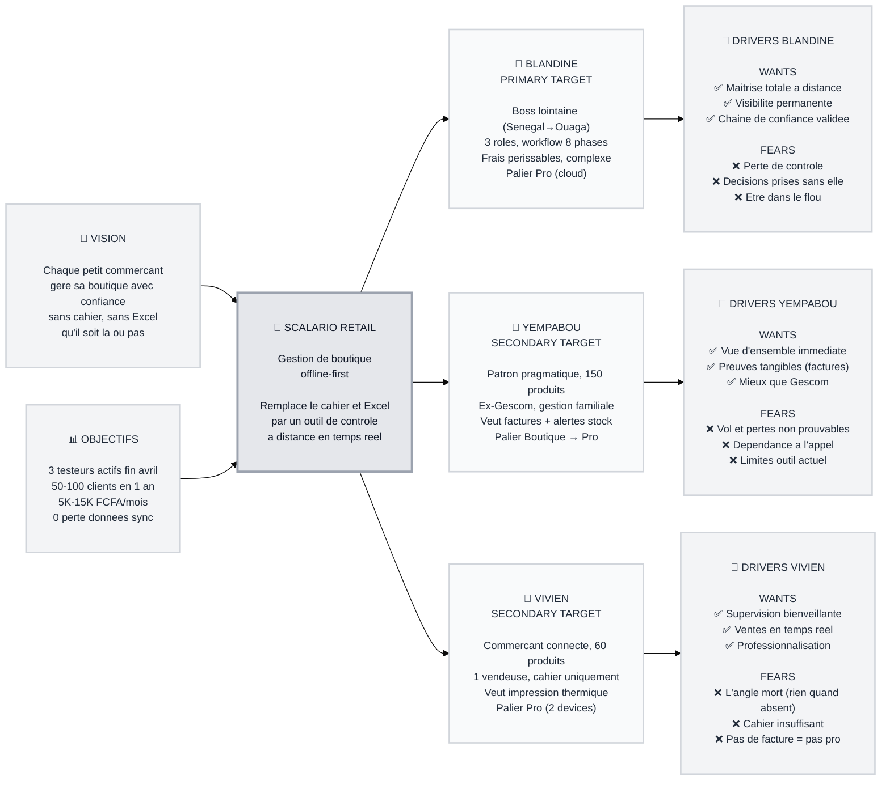

# Trigger Map — Scalario Retail Phase 1

> Reference strategique unique : Business Goals -> Target Groups -> Driving Forces -> Prioritisation

**Document:** Trigger Map - Hub
**Created:** 2026-04-06
**Status:** COMPLETE

---

## Transformation

**De :** Proprietaires de boutiques retail en Afrique de l'Ouest qui dependent d'appels telephoniques, de cahiers et d'Excel pour savoir ce qui se passe dans leur boutique quand ils ne sont pas la.

**Vers :** Proprietaires qui gerent avec confiance a distance — chaque mouvement est trace, chaque decision est validee, chaque perte est detectable.

---

## Vision

**Chaque petit commercant d'Afrique de l'Ouest gere sa boutique avec confiance — sans cahier, sans Excel, qu'il soit la ou pas.**

---

## Flywheel (moteur strategique)

**THE ENGINE (Priorite #1) :** 3 testeurs actifs (Blandine + Yempabou + Vivien) qui utilisent l'app quotidiennement d'ici fin avril 2026. Ces premiers utilisateurs valident le produit et deviennent les references pour l'acquisition future.

**Acquisition (Priorite #2) :** 50-100 clients payants dans la premiere annee. Portes par le bouche-a-oreille des testeurs et un produit objectivement superieur a Gescom (offline, factures, CRM, credit, impression thermique).

**Retention (Priorite #3) :** Abandon complet du cahier/Excel en moins de 2 semaines. Le client ne revient jamais a l'ancien outil. Pricing adapte : Solo 5K, Boutique 7.5K, Pro 15K FCFA/mois.

---

## Diagramme Trigger Map

---

## Focus Statement

**Scalario Phase 1 cible en priorite les proprietaires de boutique retail qui ne sont pas toujours sur place.** Le produit doit eliminer l'angle mort (ne pas savoir ce qui se passe quand on est absent) en offrant une visibilite en temps reel, un circuit de validation qui empeche les decisions non autorisees, et des preuves tangibles (factures, inventaires, arrets de caisse) qui rendent les pertes et le vol detectables. Si un patron au Senegal peut piloter sa boutique a Ouaga avec confiance, alors tout proprietaire qui s'absente quelques heures peut le faire aussi.

---

## Driver #1 : Perte de controle quand absent

C'est LE pattern commun aux 3 testeurs. Tout le UX doit repondre a cette question : **"Qu'est-ce qui s'est passe pendant que je n'etais pas la ?"**

---

## Comment lire cette Trigger Map

1. **Gauche → Droite** : Des objectifs business aux motivations psychologiques
2. **Business Goals** : Ce que Scalario doit atteindre (metrics)
3. **Platform** : Ce que Scalario est (produit)
4. **Target Groups** : Qui va atteindre ces objectifs par leur usage
5. **Driving Forces** : Pourquoi ils utilisent le produit (positif) et pourquoi ils ne pourraient PAS l'utiliser (negatif)

---

## Documents lies

- **[01-Business-Goals.md](01-Business-Goals.md)** - Objectifs et metriques
- **[02-Blandine.md](personas/02-Blandine.md)** - Persona primaire
- **[03-Yempabou.md](personas/03-Yempabou.md)** - Persona secondaire
- **[04-Vivien.md](personas/04-Vivien.md)** - Persona secondaire
- **[05-Key-Insights.md](05-Key-Insights.md)** - Implications strategiques

---

_Cree avec la methode WDS — Phase 2 (Trigger Mapping)_
