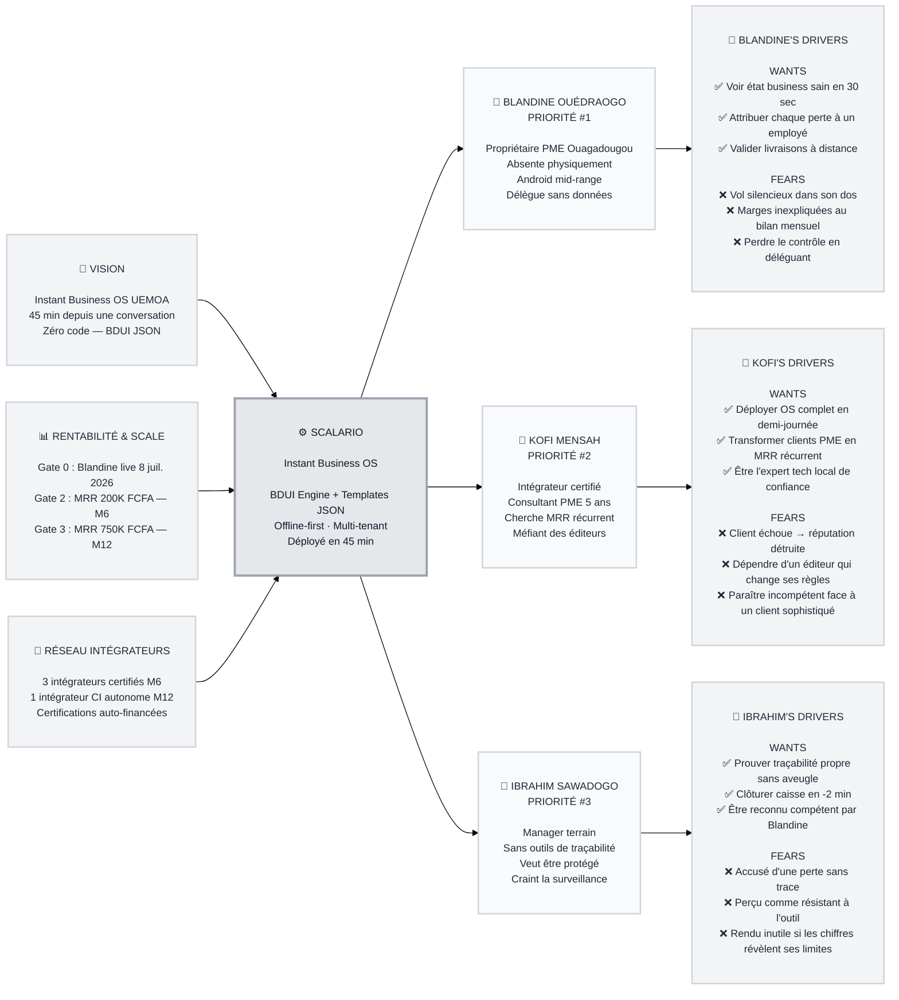

# Trigger Map: Scalario

> Connecting business goals to user psychology

**Created:** 2026-05-09
**Author:** Carlos Simporé
**Related:** [Product Brief](../A-Product-Brief/project-brief.md) | [Visual Direction](../A-Product-Brief/visual-direction.md) | [Platform Requirements](../A-Product-Brief/platform-requirements.md)

---

## Vision

> **Scalario est le premier Instant Business OS pour les PME d'Afrique subsaharienne.**
> Un système de gestion complet qu'un intégrateur local peut déployer en 45 minutes depuis une conversation, sans une ligne de code.

**Vision 5 ans :** Devenir la couche de données commune du commerce UEMOA — l'infrastructure sur laquelle tournent les apps de livraison, de credit scoring, de supply chain de toute l'Afrique de l'Ouest.

---

## Business Goals (3×3)

### Goal 1 — Devenir rentable et scalable *(objectif primaire)*

| Objectif | Cible | Date |
|----------|-------|------|
| O1.1 | Blandine utilise l'app quotidiennement sans aide | 8 juillet 2026 (Gate 0) |
| O1.2 | MRR 200K FCFA + 5 clients + 1 intégrateur autonome | Nov. 2026 — M6 (Gate 2) |
| O1.3 | MRR 750K FCFA + 15 clients + 1 intégrateur Côte d'Ivoire | Mai 2027 — M12 (Gate 3) |

### Goal 2 — Valider la proposition de valeur terrain *(prérequis : prouver avant de scaler)*

| Objectif | Cible | Date |
|----------|-------|------|
| O2.1 | Template `retail_fresh_produce.json` non modifié pour le 2ème client | Août 2026 — M3 (Gate 1) |
| O2.2 | Churn mensuel < 3% | M6 |
| O2.3 | Fréquence ouverture app Blandine = quotidien | J+90 (leading indicator #1) |

### Goal 3 — Construire le réseau d'intégrateurs certifiés *(prérequis : le moat non-achetable)*

| Objectif | Cible | Date |
|----------|-------|------|
| O3.1 | 3 intégrateurs certifiés actifs avec clients payants | M6 |
| O3.2 | 1 intégrateur autonome dans une 2ème ville | M12 |
| O3.3 | Certifications financées sur budget propre des intégrateurs | M6 (validation du modèle) |

---

## Target Groups (Priorisés)

### 1. Blandine Ouédraogo — Propriétaire PME 👥 PRIORITÉ #1

**Qui est Blandine :**
Propriétaire d'une épicerie fine à Ouagadougou, 6 employés, 8 ans d'expérience. Rarement présente physiquement — elle délègue parce qu'elle n'a pas le choix, pas parce qu'elle a des données.

**Profil psychologique :**
Intelligence terrain forte — elle *sait* quand quelque chose ne va pas, mais ne peut pas le prouver. Relation ambivalente à la technologie : fluide sur WhatsApp et Wave, mais "un ERP" lui semble hors de portée. Ce qu'elle veut : **l'équivalent digital de sa présence physique**, pas un logiciel.

**État interne :**
Quand elle pense à son business en son absence : **anxiété sourde permanente**. Pas de panique — de l'inconfort chronique. Quand elle ouvre Scalario et voit que tout est vert, elle ressent du **soulagement**, pas de la joie. La différence est critique pour le design.

**Usage Context :**
- *Accès :* Android mid-range, seule, le matin ou après une livraison
- *État émotionnel :* Vigilance calme — cherche les signaux d'alarme
- *Comportement :* Scan KPIs en 30 secondes. Si vert → ferme l'app. Si anomalie → appelle
- *Critère de décision :* "Est-ce que je vois immédiatement si quelque chose va mal ?"
- *Succès :* 30 secondes. Ouvre → scan → ferme rassurée. Sans chercher, sans scroll, sans appel

**Lien aux objectifs business :**
- ✅ **Goal 1 :** Chaque jour d'utilisation = rétention = MRR préservé
- ✅ **Goal 2 :** Sa fréquence d'ouverture quotidienne est le leading indicator #1
- ✅ **Goal 3 :** Sa satisfaction = bouche-à-oreille = pipeline intégrateur

---

### 2. Kofi Mensah — Intégrateur Certifié 👤 PRIORITÉ #2

**Qui est Kofi :**
Consultant PME depuis 5 ans à Ouagadougou, clients retail et distribution. Revenue project-based imprévisible. Connaît les problèmes de Blandine mieux qu'elle. Cherche depuis 2 ans un outil qu'il peut signer de son nom.

**Profil psychologique :**
Expertise terrain authentique — a vu des dizaines de PME échouer à adopter des logiciels. **Méfiant des promesses éditeur.** Sa réputation locale est son capital le plus précieux. Ce qui l'attire dans Scalario : l'architecture JSON. Il comprend immédiatement que c'est *lui* qui contrôle la config.

**État interne :**
Face à Scalario : **prudence excitée** — il voit le potentiel mais cherche la faille. "Qu'est-ce qui se passe quand le client a un problème à 22h ?" Due diligence émotionnelle autant que rationnelle.

**Usage Context :**
- *Accès :* Réseau ou TikTok Carlos → test sur un client "bac à sable" de confiance
- *État émotionnel :* Analyste — cherche les points de rupture avant de s'engager
- *Comportement :* Teste le flow de déploiement complet, vérifie l'UX côté Blandine, teste le mode offline
- *Critère de décision :* "Est-ce que je peux déployer ça sans appeler Carlos ?" + "Mon client comprend en 5 min ?"
- *Succès :* Premier client live sans aide externe, premier paiement commission reçu

**Lien aux objectifs business :**
- ✅ **Goal 1 :** Chaque intégrateur actif = pipeline clients sans effort Carlos
- ✅ **Goal 3 :** Il *est* le moat — sa certification + ses clients = barrière non-achetable

---

### 3. Ibrahim Sawadogo — Manager Terrain 👤 PRIORITÉ #3

**Qui est Ibrahim :**
Manager depuis 3 ans chez Blandine. Honnête, efficace, mais sans outils de traçabilité. Quand les chiffres ne collent pas, il ne peut pas se défendre.

**Profil psychologique :**
**Ambivalence défensive** — craint d'être surveillé autant qu'il veut être protégé. Son adoption dépend du cadrage : outil de contrôle (il résistera) vs. outil de traçabilité qui le protège (il l'adoptera).

**État interne :**
Face à Scalario : **méfiance → acceptation conditionnelle → routine** si l'UX est simple et le bénéfice perçu.

**Usage Context :**
- *Accès :* App imposée par Blandine, onboarding en présentiel
- *État émotionnel :* Méfiance initiale → routine si < 2 min par opération
- *Comportement :* Valide livraisons, clôture caisse. Si friction > 2 min → résistance passive
- *Critère de décision :* "Est-ce plus simple que mon cahier ?"
- *Succès :* Clôture de caisse en autonomie à J+7 sans appel Carlos

**Lien aux objectifs business :**
- ✅ **Goal 2 :** Son adoption fluide = données fiables pour Blandine = Gate 0 validé

---

## Driving Forces (Scorées)

### Blandine — Positifs

| Driver (WHAT + WHY + WHEN) | F | I | Fit | Score |
|---|---|---|---|---|
| Voir d'un coup d'œil si son business est sain — sans appeler — en ouvrant l'app le matin | 5 | 5 | 5 | **15 🔴** |
| Attribuer chaque perte à un employé précis — reprendre le contrôle des marges — quand les chiffres ne collent pas | 4 | 5 | 5 | **14 🔴** |
| Valider une livraison depuis son téléphone — remplacer sa présence physique — pendant une livraison en cours | 4 | 4 | 5 | **13 🟠** |

### Blandine — Négatifs

| Driver (WHAT + WHY + WHEN) | F | I | Fit | Score |
|---|---|---|---|---|
| Découvrir qu'on l'a volée pendant des semaines — ruine silencieuse — en ouvrant l'app chaque matin | 5 | 5 | 5 | **15 🔴** |
| Voir ses marges baisser encore sans pouvoir expliquer pourquoi — honte + impuissance — lors du bilan mensuel | 4 | 5 | 5 | **14 🔴** |
| Perdre le contrôle le jour où elle délègue — et ne jamais le retrouver — quand elle confie une responsabilité | 4 | 4 | 4 | **12 🟠** |

### Intégrateur (Kofi) — Positifs

| Driver (WHAT + WHY + WHEN) | F | I | Fit | Score |
|---|---|---|---|---|
| Déployer un business OS complet en une demi-journée — depuis une conversation + JSON — lors du premier RDV client | 5 | 5 | 5 | **15 🔴** |
| Transformer sa base clients PME en MRR récurrent — sortir de l'anxiété des projets one-shot — en fin de mission | 5 | 5 | 4 | **14 🔴** |
| Être perçu comme l'expert tech local de confiance — grâce à un produit crédible — lors du bouche-à-oreille | 3 | 4 | 4 | **11 🟡** |

### Intégrateur (Kofi) — Négatifs

| Driver (WHAT + WHY + WHEN) | F | I | Fit | Score |
|---|---|---|---|---|
| Recommander Scalario et voir son client échouer — perdre 3 ans de relation en 1 journée — lors du premier pilote | 3 | 5 | 4 | **12 🟠** |
| Devenir dépendant d'une plateforme dont les règles changent — expliquer à ses clients pourquoi — au renouvellement | 3 | 5 | 3 | **11 🟡** |

### Manager (Ibrahim) — Positifs

| Driver (WHAT + WHY + WHEN) | F | I | Fit | Score |
|---|---|---|---|---|
| Prouver que sa gestion est propre avec données traçables — sans confiance aveugle de Blandine — au bilan quotidien | 5 | 4 | 5 | **14 🔴** |
| Clôturer sa caisse en moins de 2 minutes — sans processus manuels — chaque fin de journée | 5 | 3 | 5 | **13 🟠** |

### Manager (Ibrahim) — Négatifs

| Driver (WHAT + WHY + WHEN) | F | I | Fit | Score |
|---|---|---|---|---|
| Être tenu responsable d'une perte qu'il n'a pas commise — sans trace pour se défendre — quand les chiffres ne collent pas | 3 | 5 | 5 | **13 🟠** |
| Être perçu comme résistant à l'outil parce qu'il craint la surveillance — perdre la confiance de Blandine | 2 | 4 | 3 | **9 🟡** |

**Légende scores :** 🔴 14-15 = Critique (adresser absolument) · 🟠 11-13 = Important · 🟡 8-10 = Nice-to-have

---

## Trigger Map Visualization

---

## Design Focus Statement

> Donner à Blandine la certitude visuelle et immédiate que son business est sous contrôle — même absente, même hors ligne. Chaque écran répond à "Est-ce que tout va bien en ce moment ?" et rend visible ce qui était invisible (pertes, attributions, réconciliations). Pour l'intégrateur : démontrer la puissance du moteur JSON sans jamais montrer sa complexité.

**Cible design primaire :** Blandine (propriétaire PME)

**Must Address (score 14-15) :**
- Voir état business sain en 30 secondes sans chercher
- Attribuer chaque perte à un employé ou poste précis
- Transformer la peur du vol silencieux en certitude visible
- Transformer les marges inexpliquées en données actionnables
- Déploiement intégrateur : puissance sans complexité visible

**Should Address (score 11-13) :**
- Validation livraisons à distance = remplacement présence physique
- Traçabilité manager = bouclier contre accusation injuste
- Clôture caisse < 2 minutes = adoption Ibrahim

---

## Patterns Croisés

### Drivers partagés

**Besoin de traçabilité et de preuve** — Blandine (prouver que son business est sain), Ibrahim (prouver son honnêteté), Kofi (prouver la valeur à son client). Un seul mécanisme de traçabilité robuste sert les trois.

**Peur de la délégation sans données** — Blandine délègue sans voir, Kofi recommande sans garantie. Les deux ont besoin que Scalario soit le garant de la qualité, pas juste un outil.

### Drivers uniques

**Blandine :** Anxiété de présence (spécifique au propriétaire absent)
**Kofi :** Réputation comme actif risqué (spécifique au canal de distribution)
**Ibrahim :** Ambivalence surveillance/protection (spécifique aux employés terrain)

### Tensions potentielles

**Blandine vs Ibrahim :** Ce que Blandine veut (tout voir) est exactement ce qu'Ibrahim craint (être tout vu). Résolution : cadrer l'outil comme traçabilité mutuelle, pas comme surveillance unilatérale. Les données protègent Ibrahim autant qu'elles informent Blandine.

---

## Next Steps

- [ ] **Phase 3 : UX Scenarios** — Traduire les drivers en flows design (dashboard Blandine, validation croisée, clôture caisse)
- [ ] **Valider avec terrain** — Gate 0 (8 juillet 2026) validera ou invalidera les hypothèses sur Blandine
- [ ] **Mettre à jour v2** — Après retour terrain J+30, affiner les scores si comportement réel diverge

---

_Trigger Map v1.0 — Carlos Simporé — 2026-05-09_
_Methodology: Effect Mapping (Balic & Domingues, inUse), adapted by WDS with negative driving forces_
