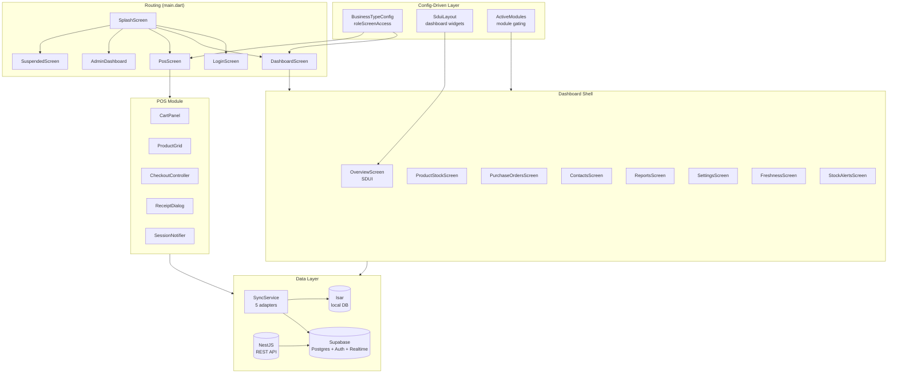

# Analyse Architecture Flutter — Scalario
**Phase 5 — [A] Analysis**
**Date :** 2026-04-01
**Question :** Quelles features des 11 scénarios UX existent déjà dans Flutter, quelles manquent, et où ajouter les nouvelles ?

---

## 1. Architecture Flutter

### Stack technique

| Composant | Technologie | Version |
|-----------|------------|---------|
| UI Framework | Flutter | SDK ^3.10.7 |
| State management | Riverpod | ^2.5.1 |
| DB locale | Isar | ^3.1.0 |
| Backend auth/realtime | Supabase | ^1.10.0 |
| API REST | NestJS (apps/backend) + http client | — |
| Charts | fl_chart | ^0.70.2 |
| PDF/Reçus | pdf + printing | — |
| Scanner | mobile_scanner | ^7.1.4 |
| SDUI | Custom (sdui_layout, sdui_renderer, sdui_widget_registry) | — |

### Structure des dossiers

```
apps/frontend/lib/
├── app/
│   └── sdui_registry_setup.dart       ← Enregistrement widgets SDUI au démarrage
├── core/
│   ├── auth/                          ← AuthRepository, AuthState, UserProfile
│   ├── constants/                     ← ApiConstants
│   ├── models/                        ← SyncMetadata, SyncStatus
│   ├── providers/                     ← ActiveModulesProvider, PaymentMethodsProvider
│   ├── sdui/                          ← SduiLayout, SduiProviders, SduiRenderer, SduiWidgetRegistry
│   ├── services/                      ← BarcodeScanner, DeviceIdentity, Isar, Realtime, Receipt,
│   │                                     Retention, Sdui, SyncService + adapters (5)
│   ├── settings/                      ← SettingsScreen
│   ├── theme/                         ← AppBreakpoints (kCompact=600dp), AppLogos, AppTheme
│   ├── utils/                         ← ConflictResolution
│   └── widgets/                       ← BarcodeListener, ProductAutocomplete, ScalarioAppBar
├── features/
│   ├── admin/                         ← Superadmin panel (Carlos only)
│   ├── auth/                          ← LoginScreen
│   ├── retail/
│   │   ├── backoffice/                ← DashboardScreen + DashboardShell
│   │   └── pos/                       ← PosScreen + CartPanel + tous les widgets POS
│   └── shared/                        ← Modules métier (voir ci-dessous)
│       ├── billing/                   ← SubscriptionScreen, SuspendedScreen
│       ├── business_type/             ← BusinessTypeConfig (routing config-driven)
│       ├── catalog/                   ← CategoriesScreen, ProductFormDialog, VariantFormSheet
│       ├── client_orders/             ← CommandesClients (5 écrans)
│       ├── contacts/                  ← ContactsScreen (clients à crédit)
│       ├── expenses/                  ← ExpensesScreen
│       ├── freshness/                 ← FreshnessScreen (péremptions)
│       ├── inventory/                 ← ProductStockScreen, InventoryCountScreen, InternalRequestsScreen
│       ├── notifications/             ← NotificationBell
│       ├── promotions/                ← PromotionsScreen
│       ├── purchase_orders/           ← PurchaseOrdersScreen, ReceivePurchaseOrderSheet
│       ├── reports/                   ← ReportsScreen, SalesHistoryScreen, SessionHistoryScreen
│       ├── reservations/              ← ReservationsScreen
│       ├── returns/                   ← (repository seulement)
│       └── stock_alerts/              ← StockAlertsScreen
└── main.dart                          ← Entry point + routing
```

### Pattern architecture : Clean Architecture Feature-First

Chaque feature suit :
```
feature/
├── data/
│   ├── models/          ← Isar models (.dart + .g.dart généré)
│   ├── repositories/    ← Accès données (Isar local + Supabase/HTTP)
│   └── services/        ← Services métier
└── presentation/
    ├── providers/        ← Riverpod providers (AsyncNotifier, StateNotifier)
    ├── screens/          ← Écrans complets (Scaffold)
    ├── state/            ← Notifiers complexes (CartNotifier, SessionNotifier)
    └── widgets/          ← Composants réutilisables
```

### Flux d'authentification et routing (main.dart)

```
SplashScreen
    ↓
Auth check (Supabase)
    ├─ Non authentifié → LoginScreen
    └─ Authentifié
        ├─ superadmin → AdminDashboard (panel Carlos)
        ├─ billing suspendu → SuspendedScreen
        └─ tenant user
            ├─ role config via businessTypeConfigProvider (SDUI-driven)
            ├─ owner / manager → DashboardScreen (backoffice)
            └─ commercial / cashier → PosScreen (direct)
```

### Rôles existants

| Rôle Flutter | Écrans par défaut | Correspondance UX |
|-------------|-------------------|-------------------|
| `superadmin` | AdminDashboard | Carlos (intégrateur superadmin) |
| `owner` | backoffice + pos | Blandine (propriétaire) |
| `manager` | backoffice_restricted | Gestionnaire de Blandine |
| `commercial` | pos + losses + transfers + stock_view + daily_sales | Vendeur étendu |
| `cashier` | pos seulement | Bernard (vendeur simple) |

### Navigation (DashboardShell)

- **≥ 600dp** : `NavigationRail` (extended à ≥ 1200dp) — sidebar style
- **< 600dp** : `BottomNavigationBar` (max 5 items)
- Tabs **module-gated** : visibles uniquement si le module est actif ET si le rôle y a accès
- Tabs disponibles : Accueil · Produits & Stock · Achats · Clients · Rapports · Dépenses · Promotions · Réservations · Commandes · Ventes · Paramètres

### SDUI (Server-Driven UI)

Le dashboard principal (`OverviewScreen`) est piloté par le backend. Layout JSON → `SduiRenderer`.

**Widgets SDUI enregistrés :**
- `product_grid` → `ProductGrid`
- `cart_panel` → `CartPanel`
- `kpi_card_grid` → `KpiCardGrid`
- `line_chart` → `LineChartWidget`
- `terminal_status_list` → `TerminalStatusList`

**Implication design :** Le layout du dashboard (02.1) peut être modifié côté backend sans mise à jour app.

### Sync offline

`SyncService` avec 5 adaptateurs : `catalog`, `contact`, `inventory`, `session`, `transaction`.
Data locale dans Isar. Supabase Realtime pour updates en temps réel.

---

## 2. Gap Analysis — 11 Scénarios UX vs Flutter

### Légende
- ✅ **Existe** — implémenté, utilisable
- ⚠️ **Partiel** — logique présente mais forme UX différente (dialog vs screen, état dans state vs écran dédié)
- ❌ **Manque** — à créer de zéro

---

### Scénario 01 — Blandine Ferme Sa Caisse (4 pages)

| Page UX | Description | Flutter | Statut |
|---------|-------------|---------|--------|
| 01.1 | Arrêt caisse — soumission | `session_notifier.dart` gère l'état, `session_guard.dart` + `session_report_dialog.dart` | ⚠️ Partiel — pas d'écran dédié "fermeture de caisse" isolé |
| 01.2 | Arrêt caisse — récapitulatif | `z_report_service.dart` + `session_report_dialog.dart` | ⚠️ Partiel — dans un dialog, pas un flow step-by-step |
| 01.3 | Arrêt caisse — confirmation | `receipt_service.dart` | ⚠️ Partiel |
| 01.4 | Historique sessions | `session_history_screen.dart` | ✅ Existe |

**Verdict :** Le flow de fermeture de caisse est éparpillé dans des dialogs. Besoin d'un écran de caisse dédié step-by-step (ou refactorer `session_report_dialog` en flow wizard).

---

### Scénario 02 — Blandine Surveille à Distance (2 pages)

| Page UX | Description | Flutter | Statut |
|---------|-------------|---------|--------|
| 02.1 | Dashboard propriétaire | `OverviewScreen` (SDUI) avec KPIs, graphiques, sessions actives | ✅ Existe — SDUI-driven |
| 02.2 | Centre alertes | `stock_alerts_screen.dart` (alertes stock) + `notification_bell.dart` | ⚠️ Partiel — alertes stock OK, mais pas de centre alertes unifié (péremptions + ruptures + alertes en un seul endroit) |

---

### Scénario 03 — Bernard Découvre Scalario Seul (3 pages)

| Page UX | Description | Flutter | Statut |
|---------|-------------|---------|--------|
| 03.1 | Splash | `splash_screen.dart` | ✅ Existe |
| 03.2 | Login | `login_screen.dart` (email + password Supabase) | ✅ Existe |
| 03.3 | Onboarding wizard | **AUCUN** | ❌ Manque — H2 priorité (Ibrahim déploie le client) |

---

### Scénario 04 — Bernard Vend et Sait Ce Qu'il a Gagné (6 pages)

| Page UX | Description | Flutter | Statut |
|---------|-------------|---------|--------|
| 04.1 | Dashboard employé — identification PIN | **AUCUN** (`session_guard.dart` vérifie session mais pas PIN identification) | ❌ Manque — écran de sélection employé + PIN à créer |
| 04.2 | POS Catalogue | `pos_screen.dart` + `product_grid.dart` + filtres catégories | ✅ Existe |
| 04.3 | POS Panier | `cart_panel.dart` + `cart_item_list.dart` + `cart_item_tile.dart` | ✅ Existe |
| 04.4 | POS Paiement | `checkout_controller.dart` + paiement dans `cart_footer.dart` / dialogs | ⚠️ Partiel — logique OK, UX mode paiement à vérifier |
| 04.5 | POS Reçu | `receipt_dialog.dart` + `receipt_service.dart` | ✅ Existe |
| 04.6 | Stock & Bilan du jour | `product_stock_screen.dart` + `daily_sales_page.dart` | ✅ Existe (scindé en 2 écrans) |

**Verdict :** PIN identification = gap critique pour la démo Blandine. Les écrans POS (04.2–04.5) sont solides.

---

### Scénario 05 — Cheick Configure Ses Variantes (4 pages)

| Page UX | Description | Flutter | Statut |
|---------|-------------|---------|--------|
| 05.1 | Produits liste catalogue | `product_stock_screen.dart` (vue stock avec produits) | ⚠️ Partiel — vue orientée stock, pas vraiment liste catalogue éditable |
| 05.2 | Produits création/édition | `product_form_dialog.dart` | ✅ Existe (sous forme dialog) |
| 05.3 | Variantes gestion multi-SKU | `variant_form_sheet.dart` + `product_variant.dart` | ✅ Existe |
| 05.4 | Stock fiche produit variantes | `product_stock_screen.dart` + `product_detail_sheet.dart` | ✅ Existe |

---

### Scénario 06 — Cheick Vend à un Client à Crédit (2 pages)

| Page UX | Description | Flutter | Statut |
|---------|-------------|---------|--------|
| 06.1 | Clients liste | `contacts_screen.dart` | ✅ Existe |
| 06.2 | Clients fiche solde crédit | `contacts_screen.dart` (drill-down) + `settle_debt_dialog.dart` | ⚠️ Partiel — fiche client détaillée avec historique crédit à vérifier |

---

### Scénario 07 — Cheick Agit sur ses Péremptions (1 page)

| Page UX | Description | Flutter | Statut |
|---------|-------------|---------|--------|
| 07.1 | Péremptions tableau de bord | `freshness_screen.dart` + `declassify_sheet.dart` + `freshness_chip.dart` | ✅ Existe |

---

### Scénario 08 — Ibrahim Déploie Son Premier Client (2 pages)

| Page UX | Description | Flutter | Statut |
|---------|-------------|---------|--------|
| 08.1 | AI Config Wizard | **AUCUN** | ❌ Manque — feature H2 |
| 08.2 | Dashboard intégrateur | `admin_dashboard.dart` + `admin_tenants_screen.dart` | ⚠️ Partiel — c'est le panel superadmin de Carlos, pas un dashboard partenaire Ibrahim |

---

### Scénario 09 — Configuration de la Boutique (4 pages)

| Page UX | Description | Flutter | Statut |
|---------|-------------|---------|--------|
| 09.1 | Utilisateurs liste + rôles | **AUCUN** (géré côté admin superadmin uniquement) | ❌ Manque — à créer côté client |
| 09.2 | Utilisateurs création/édition | **AUCUN** | ❌ Manque |
| 09.3 | Paramètres général boutique | `settings_screen.dart` | ⚠️ Partiel — à vérifier contenu (nom, logo, devise, fuseau…) |
| 09.4 | Paramètres intégrations (mobile money) | **AUCUN** | ❌ Manque |

---

### Scénario 10 — Gestionnaire Réceptionne une Livraison (2 pages)

| Page UX | Description | Flutter | Statut |
|---------|-------------|---------|--------|
| 10.1 | Stock réception marchandise | `receive_purchase_order_sheet.dart` + `purchase_orders_screen.dart` | ✅ Existe (en sheet dans flux achats) |
| 10.2 | Stock inventaire/ajustement | `inventory_count_screen.dart` | ✅ Existe |

**Note Taux de Frotte :** Vérifie si `receive_purchase_order_sheet.dart` applique le taux de frotte automatiquement — c'est le différenciateur clé de ce scénario.

---

### Scénario 11 — Blandine Lit Ses Rapports (2 pages)

| Page UX | Description | Flutter | Statut |
|---------|-------------|---------|--------|
| 11.1 | Rapports ventes + GenUI | `reports_screen.dart` + `sales_history_screen.dart` + `kpi_card_grid.dart` + `line_chart_widget.dart` | ⚠️ Partiel — rapports ventes OK, **GenUI = 0** |
| 11.2 | Rapports stock + GenUI | `reports_screen.dart` (tab stock ?) | ⚠️ Partiel — **GenUI = 0**, visualisations générées inexistantes |

**Note GenUI :** C'est le différenciateur Premium analytics — à implémenter via LLM API (H2). Les rapports de base existent déjà.

---

## 3. Tableau Synthèse Gap Analysis

| Statut | Nb pages | Pages |
|--------|---------|-------|
| ✅ Existe | 14 | 03.1, 03.2, 04.2, 04.3, 04.5, 04.6, 05.2, 05.3, 05.4, 06.1, 07.1, 10.1, 10.2 (+ 01.4) |
| ⚠️ Partiel | 12 | 01.1, 01.2, 01.3, 02.1, 02.2, 04.4, 05.1, 06.2, 08.2, 09.3, 11.1, 11.2 |
| ❌ Manque | 7 | 03.3, 04.1, 08.1, 09.1, 09.2, 09.4 + GenUI (11.1/11.2) |

**33 pages UX au total · ~42% complètes · ~36% partielles · ~21% à créer**

---

## 4. Écrans Orphelins (Flutter sans équivalent dans les 11 scénarios)

Ces écrans **existent** dans Flutter mais n'ont pas de page UX correspondante dans les 11 scénarios.

| Écran Flutter | Module | Décision suggérée |
|--------------|--------|-------------------|
| `daily_sales_page.dart` | POS | **Garder** — absorber dans 04.6 ou 01.x (bilan journalier) |
| `loss_declaration_page.dart` | POS | **Garder** — feature valide (pertes POS), ajouter au scénario 10 ou en annexe |
| `transfer_confirm_page.dart` | Stock | **Garder** — transfert inter-boutiques, utile multi-branches |
| `promotions_screen.dart` | Promotions | **Garder** — module activable, pas prioritaire démo |
| `expenses_screen.dart` | Dépenses | **Garder** — module activable, pas prioritaire démo |
| `client_orders/*` (5 écrans) | Commandes clients | **Garder** — workflow B2B complet (commandes, livraisons, devis) |
| `reservations_screen.dart` | Réservations | **Garder** — activable selon business type |
| `internal_requests_screen.dart` | Stock interne | **Garder** — multi-entrepôts |
| `serial_records_screen.dart` | Catalogue | **Garder** — suivi numéros série (pharmacie, électronique) |
| `subscription_screen.dart` + `suspended_screen.dart` | Billing | **Garder** — infrastructure billing |
| `admin/*` (7 écrans) | SuperAdmin | **Garder** — panel Carlos, hors scope client |
| `purchase_order_detail_screen.dart` | Achats | **Garder** — détail bon de commande |

**Aucun écran à supprimer.** Tous ont une raison d'être, mais plusieurs sont hors scope de la démo Blandine.

---

## 5. Recommandations — Où Ajouter Chaque Nouvelle Vue

### Priorité 1 — Démo Blandine (avant mi-avril)

| Feature manquante | Où l'ajouter | Effort estimé |
|------------------|-------------|---------------|
| **04.1 — PIN identification vendeur** | Nouveau screen `features/retail/pos/presentation/screens/employee_pin_screen.dart` · injecter avant `PosScreen` dans le routing commercial/cashier | Moyen |
| **01.x — Flow fermeture caisse** | Refactorer `session_report_dialog.dart` en wizard steps ou créer `pos/presentation/screens/session_close_screen.dart` | Moyen |
| **02.2 — Centre alertes unifié** | Nouveau screen `features/shared/notifications/presentation/screens/alerts_center_screen.dart` · agréger stock_alerts + freshness + notifications | Moyen |

### Priorité 2 — Post-démo (H1 2026)

| Feature manquante | Où l'ajouter | Effort estimé |
|------------------|-------------|---------------|
| **09.1/09.2 — Gestion utilisateurs** | Nouveau feature `features/shared/team/` · screens: `team_screen.dart` (liste) + `team_member_form_screen.dart` (création/édition) | Moyen |
| **09.4 — Paramètres intégrations** | Ajouter tab "Intégrations" dans `core/settings/settings_screen.dart` | Faible |
| **10.1 — Taux de Frotte auto** | Vérifier + compléter `receive_purchase_order_sheet.dart` — ajouter calcul frotte depuis `BusinessTypeConfig` | Faible–Moyen |

### Priorité 3 — H2 2026

| Feature manquante | Où l'ajouter | Effort estimé |
|------------------|-------------|---------------|
| **11.1/11.2 — GenUI Analytics** | Nouveau widget SDUI `genui_query_panel` · provider avec LLM API call · enregistrer dans `sdui_registry_setup.dart` | Élevé |
| **03.3 — Onboarding wizard** | Nouveau screen `features/auth/onboarding_wizard_screen.dart` · injecter après premier login | Moyen |
| **08.1 — AI Config Wizard** | Nouveau feature `features/integrator/` · Ibrahim-specific (partenaire panel séparé) | Élevé |
| **08.2 — Dashboard intégrateur** | Refactorer ou étendre `admin/` avec un accès partenaire distinct (rôle `integrator`) | Moyen |

---

## 6. Diagramme Architecture (Mermaid)



---

## 7. Décisions requises — Écrans orphelins

Pour les 12 catégories d'écrans orphelins, voici la recommandation : **Garder tout.** Aucun écran orphelin n'est redondant — ils correspondent à des modules activables selon le `businessTypeConfig`. La question n'est pas "supprimer ou garder" mais "couvrir dans un scénario UX ou laisser hors-scope".

Si tu veux les documenter, ajouter un scénario 12+ par module (Promotions, Dépenses, Commandes clients) lors d'une phase 3 itération — après la démo Blandine.

---

## Synthèse exécutive

**Ce qui tient la route :**
- Architecture Clean Architecture feature-first bien structurée
- POS complet et solide (04.2–04.5)
- Dashboard SDUI = flexibilité maximale pour Blandine
- Sync offline robuste (Isar + Supabase)
- Navigation responsive (RailNav/BottomNav breakpoint 600dp) déjà en place

**Ce qui bloque la démo Blandine :**
1. **PIN identification vendeur (04.1)** — absent
2. **Flow fermeture caisse (01.x)** — éparpillé dans des dialogs
3. **Centre alertes unifié (02.2)** — partiel

**Ce qui attend H2 :**
- GenUI Analytics (11.x) — différenciateur Premium, LLM requis
- Onboarding wizard (03.3) — post-acquisition
- AI Config + Ibrahim panel (08.x) — architecture partenaire

---

_Analyse Flutter Scalario · Phase 5 [A] · 2026-04-01_
