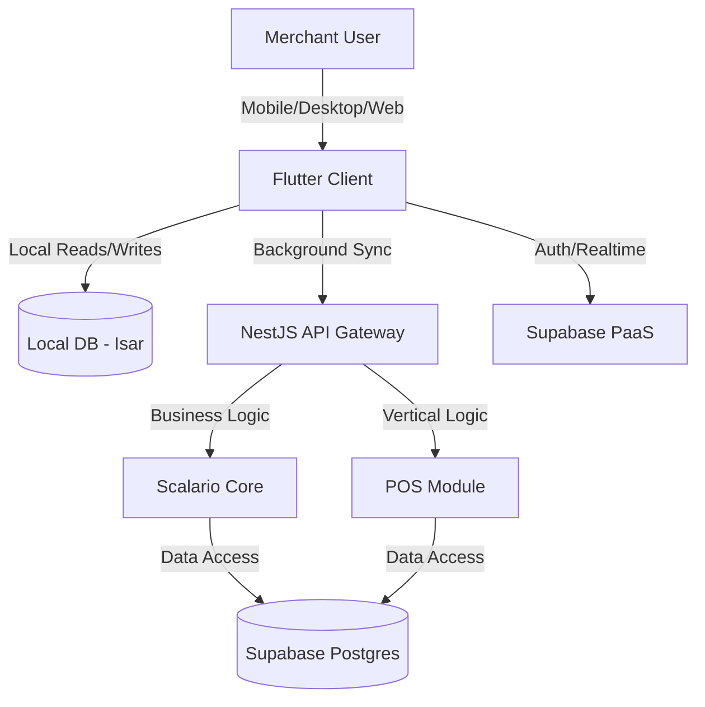

# Architecture: Scalario Core + POS

**Version:** 1.0
**Status:** Approved
**Author:** Solution Architect Agent (BMAD)

## 1. High-Level Architecture
Scalario follows a **Modular Monolith** approach on the backend and a **Layered Architecture** on the frontend, designed for strict Multi-Tenancy and Offline-First operations.

### 1.2 Key Principles
1.  **Multi-Tenant SaaS:** Data strictly isolated by `tenant_id`.
2.  **Offline-First:** The client *always* writes to the local DB first. Sync happens in the background.
3.  **API-First:** All backend logic exposed via REST/GraphQL for future integrations.
4.  **Extensible:** Core services (Auth, Org) are decoupled from vertical modules (POS, Inventory).

## 2. Technical Stack & Roles

### 2.1 Backend: NestJS
-   **Role:** Orchestrator, Heavy Business Logic, Complex Validations, Sync Conflict Resolution.
-   **Modules:**
    -   `@app/core`: Tenant guards, Logging, Common DTOs.
    -   `@app/pos`: Sales processing, Inventory logic.

### 2.2 Database & Auth: Supabase
-   **Auth:** JWT management, user sessions.
-   **Database:** PostgreSQL with RLS (Row Level Security).
    -   *Policy:* `auth.uid() = user_id` and `tenant_id = current_tenant`.
-   **Realtime:** Push notifications for critical updates (e.g., "Stock updated at HQ").
-   **Storage:** Product images, Receipts.

### 2.3 Frontend: Flutter
-   **Role:** One codebase for Android (POS Tablet), Windows (Desktop Counter), Web (Admin Dashboard).
-   **State Management:** Riverpod / BLoC (TBD).
-   **Local Database:** Isar (High performance, NoSQL-like) or SQLite (Drift). Used for offline caching.

## 3. Critical Flows

### 3.1 Data Flow & Sync Strategy
1.  **Read:** Application reads from **Local DB**. Background process refreshes Local DB from Remote API (Delta Sync: `last_sync_timestamp`).
2.  **Write (Offline):** Action (e.g., `CREATE_ORDER`) saved to Local "Outbox" Queue.
3.  **Sync (Online):**
    -   Client pushes Outbox items to NestJS API.
    -   NestJS validates & persists to Supabase Postgres.
    -   NestJS responds with success/failure.
    -   Client removes item from Outbox.

### 3.2 Security Boundaries
-   **Frontend:** Cannot be trusted. All inputs validated by NestJS.
-   **Supabase RLS:** Acts as the final safety net preventing cross-tenant data leaks.
-   **API:** Protected by JWT verification (Supabase Guard in NestJS).
